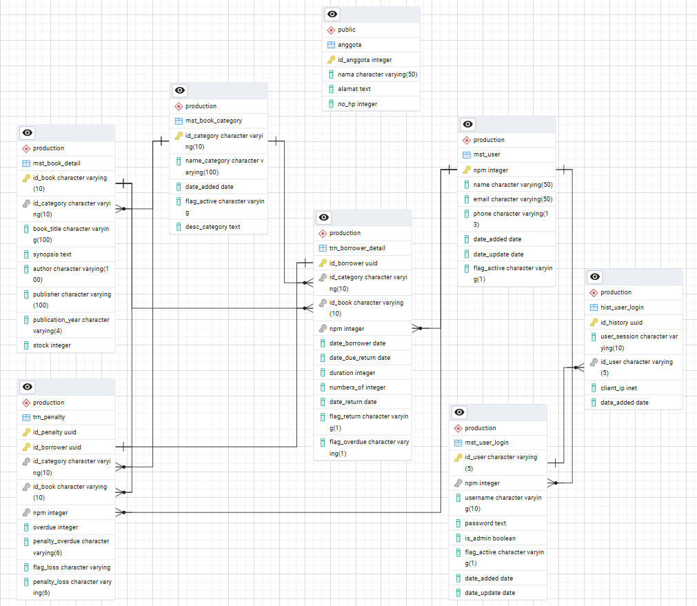

# sistem-manajemen-perpustakaan-postgresql
Perancangan Database RDBMS Sistem Manajemen Perpustakaan Menggunakan PostgreSQL.

---

## Fitur Utama Database

* **Custom Schema Isolation:** Seluruh objek database diisolasi di dalam skema khusus (`production`) untuk menjaga struktur basis data tetap teratur.
* **Automated Data Security (`pgcrypto`):** Menggunakan ekstensi `pgcrypto` dan *Trigger Function* (`fnc_add_cred_login`) untuk mengenkripsi *password* pengguna secara otomatis menggunakan algoritma **Blowfish** saat data dimasukkan.
* **Automated Business Logic:** Penerapan *Triggers* dan *Functions* untuk menangani validasi dan otomatisasi alur transaksi secara real-time pada database.
* **Data Integrity & Normalization:** Penerapan *Primary Key*, *Foreign Key*, dan *Constraints* yang ketat guna menjamin konsistensi data transaksi perpustakaan.

---

## Struktur Repositori

```text
.
├── 01_schema.sql              # Script DDL (CREATE SCHEMA, Tables, PK/FK, Constraints)
├── 02_functions_triggers.sql   # Script Trigger Functions (pgcrypto & logika bisnis)
├── 03_sample_data.sql         # Script DML (Data dummy/sampel untuk pengujian)
├── erd_diagram.png            # Diagram Visual ERD (Entity Relationship Diagram)
└── README.md                 # Dokumentasi utama proyek
```

---

## Logical Record Structure (LRS)



---

## Panduan Penggunaan & Eksekusi Script

### 1. Prasyarat
Pastikan **PostgreSQL** sudah terpasang dan aktifkan ekstensi `pgcrypto` pada database kamu:

```sql
CREATE EXTENSION IF NOT EXISTS pgcrypto;
```

### 2. Jalankan Script Secara Berurutan

Kamu bisa menjalankan script ini melalui **pgAdmin Query Tool** atau via **Terminal/CLI (`psql`)**:

* **Langkah 1: Membuat Skema & Tabel**
  ```bash
  psql -U postgres -d librarydb -f schema.sql
  ```
* **Langkah 2: Mengaktifkan Functions & Triggers
  ```bash
  psql -U postgres -d librarydb -f trigger_function.sql
  ```
* **Langkah 3: Memasukkan Data Sampel (Opsional)
  ```bash
  psql -U postgres -d librarydb -f sample_data.sql
  ```

---

## Catatan Keamanan

* **Automatic Password Hashing:** Skrip enkripsi pada `trigger_function.sql` secara otomatis mengubah *plain text password* menjadi *hash* aman menggunakan `pgcrypto` sebelum disimpan ke dalam tabel basis data.
* **Safe Repository Data:** Repositori ini hanya berisi skema struktur, logika bisnis, dan data sampel dummy. Tidak ada kredensial atau data sensitif yang tersimpan.

